# Hybrid RAG — Retrieval-Augmented Generation with Dense + Sparse Search

A self-correcting **Hybrid Retrieval-Augmented Generation** pipeline that combines **FAISS vector search** (semantic understanding) with **BM25 keyword search** (exact matching) to answer questions about your documents — PDFs, DOCX, CSV, Excel, images (OCR), and plain text.

Built with **LangChain**, **LangGraph**, **Groq** (free LLM inference), and **HuggingFace** embeddings.

---

## Why Hybrid RAG?

Traditional RAG systems use **only** vector search (dense retrieval). This works well for semantically similar queries but fails on:

| Query Type | Vector-Only RAG | Hybrid RAG |
|---|---|---|
| `"PSK modulation"` (exact term) | ❌ May miss — relies on embedding similarity | ✅ BM25 finds exact keyword match |
| `"how does the system handle errors"` (semantic) | ✅ Embeddings capture meaning | ✅ FAISS handles this |
| `"OFDM"` (acronym) | ❌ Embedding may not map acronyms well | ✅ BM25 finds exact string |
| `"wireless communication"` vs `"radio transmission"` (synonym) | ✅ Embeddings understand synonyms | ✅ FAISS handles, BM25 may miss |

**Hybrid RAG combines both**, then fuses scores so you get the best of both worlds. This project goes further by adding a **self-correcting LangGraph flow** that automatically rewrites bad queries and retries retrieval.

### How Hybrid Fusion Works

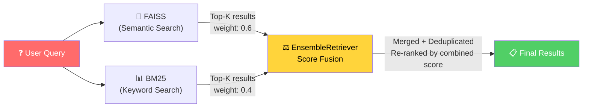

**Example**: Query = `"PSK modulation technique"`

| Retriever | Finds | Score |
|---|---|---|
| FAISS (semantic) | Chunk about "digital modulation methods" | 0.82 |
| FAISS (semantic) | Chunk about "phase shift keying" | 0.79 |
| BM25 (keyword) | Chunk containing exact phrase "PSK modulation" | 0.91 |
| BM25 (keyword) | Chunk mentioning "PSK" in a table | 0.73 |

After fusion: `final_score = (0.6 × FAISS_score) + (0.4 × BM25_score)` → best chunks from both are merged and deduplicated.

---

##  Features

- **Hybrid Retrieval** — FAISS (dense/semantic) + BM25 (sparse/keyword) with configurable weights
- **Self-Correcting Pipeline** — LangGraph flow grades retrieved chunks for relevance; auto-rewrites the query and retries if results are poor
- **Multi-Format Ingestion** — PDF, DOCX, CSV, Excel (.xlsx/.xls), TXT, and images (OCR via Tesseract)
- **GPU Acceleration** — Auto-detects NVIDIA CUDA for faster embedding generation
- **Source Attribution** — Every answer cites the source file(s) it was derived from
- **Persistent Vector Index** — FAISS index is saved to disk; rebuilds only when needed
- **Configurable via `.env`** — Retrieval weights, chunk sizes, model selection, retry limits

---

##  High-Level Architecture

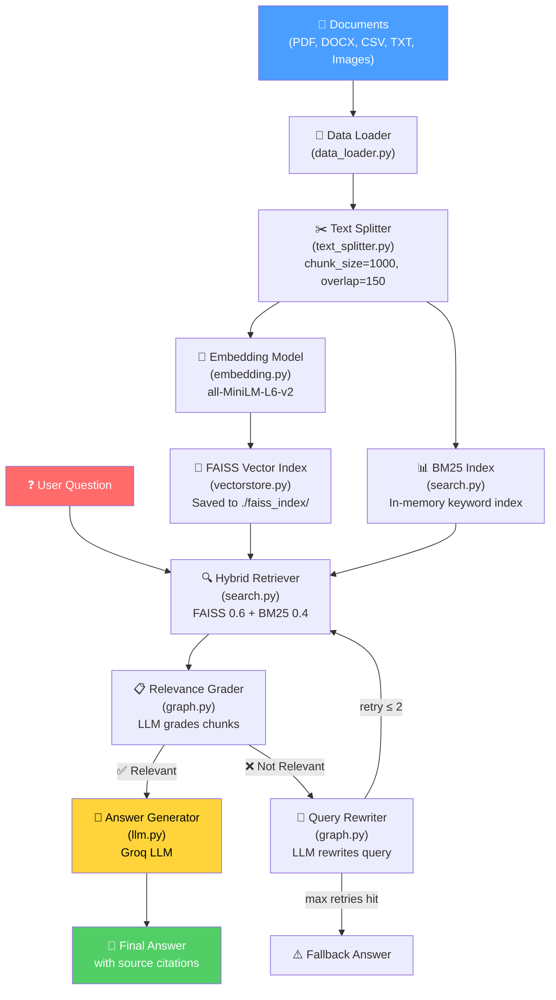

---

## 📁 Project Structure

```
hybrid-rag/
├── main.py                    # Entry point — builds pipeline, runs interactive Q&A loop
├── .env                       # API keys & configuration (not committed to Git)
├── requirements.txt           # Python dependencies
├── pyproject.toml             # Project metadata
├── data/                      # Drop your documents here (PDF, DOCX, CSV, TXT, images)
│   ├── BlackBook.pdf
│   └── ...
├── faiss_index/               # Auto-generated FAISS index (saved to disk)
│   ├── index.faiss
│   └── index.pkl
└── pipeline/                  # Core RAG pipeline modules
    ├── __init__.py
    ├── data_loader.py         # Multi-format document loader (PDF, DOCX, CSV, Excel, OCR)
    ├── text_splitter.py       # Recursive character text splitter with smart chunking
    ├── embedding.py           # HuggingFace embedding model (GPU auto-detect)
    ├── vectorstore.py         # FAISS index build/load/save with caching
    ├── search.py              # BM25 + FAISS hybrid retriever with EnsembleRetriever
    ├── llm.py                 # Groq LLM integration + RAG prompt template
    └── graph.py               # LangGraph self-correcting flow (retrieve → grade → generate)
```

---

## ⚙️ How It Works — Step-by-Step Pipeline Deep Dive

### Step 1: Document Ingestion (`data_loader.py`)

The loader walks the `./data` directory and routes each file to a specialized parser based on its extension.

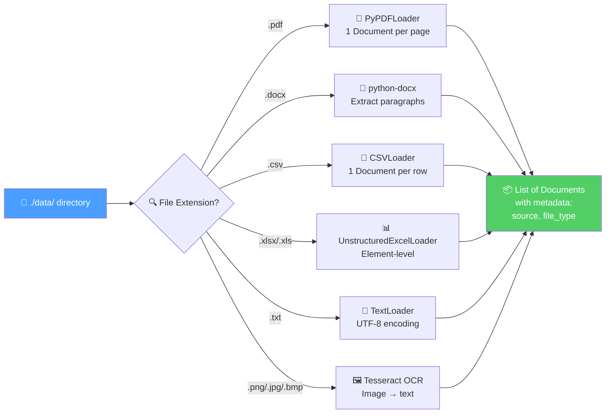

**Example**: Loading `BlackBook.pdf` (98 pages)

```
Input:  BlackBook.pdf (8.5 MB, 98 pages)
Output: 98 Document objects, each containing one page of text
        metadata = {"source": "data/BlackBook.pdf", "file_type": "pdf"}
```

Every document gets metadata attached (`source` path + `file_type`) so the final answer can cite which file it came from.

---

### Step 2: Text Chunking (`text_splitter.py`)

Raw documents are too long to embed effectively. The chunker splits them into overlapping pieces while preserving semantic coherence.

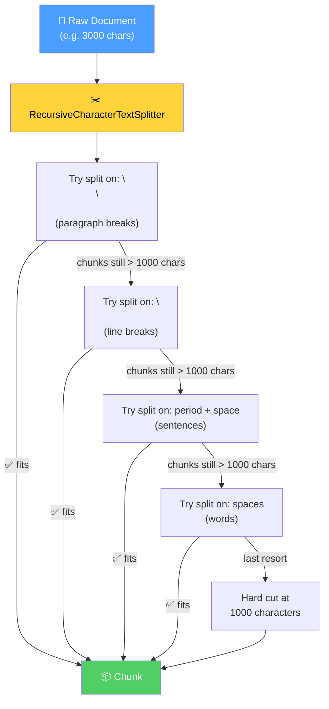

**Example**: A 3000-character page becomes 3 chunks with overlap:

```
Original page (3000 chars):
┌──────────────────────────────────────────────────────────┐
│ The PSK modulation technique involves changing the phase │
│ of a carrier signal to encode data. In BPSK, two phase   │
│ states represent binary 0 and 1. QPSK uses four phase    │
│ ... (continues for 3000 characters) ...                  │
│ The BER performance depends on the SNR and channel model.│
└──────────────────────────────────────────────────────────┘

After splitting (chunk_size=1000, overlap=150):

Chunk 1 (chars 0-1000):
┌──────────────────────────┐
│ The PSK modulation ...   │
│ ... QPSK uses four ...   │
│ ... phase constellation  │◄── 150 chars overlap ──┐
└──────────────────────────┘                         │
                                                     │
Chunk 2 (chars 850-1850):                            │
┌──────────────────────────┐                         │
│ phase constellation ...  │◄────────────────────────┘
│ ... 16-QAM increases ... │
│ ... spectral efficiency  │◄── 150 chars overlap ──┐
└──────────────────────────┘                         │
                                                     │
Chunk 3 (chars 1700-2700):                           │
┌──────────────────────────┐                         │
│ spectral efficiency ...  │◄────────────────────────┘
│ ... BER performance ...  │
│ ... channel model.       │
└──────────────────────────┘
```

The **150-character overlap** ensures that information spanning a chunk boundary isn't lost.

**Smart skipping**: CSV rows (already atomic) and short documents (< 1000 chars) bypass splitting entirely.

---

### Step 3: Embedding Generation (`embedding.py`)

Each text chunk is converted into a **384-dimensional numerical vector** that captures its semantic meaning.

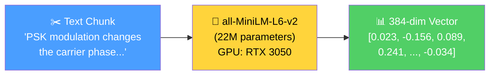

**How embeddings capture meaning**:
```
"PSK modulation technique"     → vector A: [0.23, -0.15, 0.08, ...]
"phase shift keying method"    → vector B: [0.21, -0.14, 0.09, ...]  ← very similar!
"chocolate cake recipe"        → vector C: [-0.45, 0.33, -0.67, ...]  ← very different!

cosine_similarity(A, B) = 0.94  ← semantically similar
cosine_similarity(A, C) = 0.12  ← semantically unrelated
```

The model runs on **GPU (CUDA)** if available, falling back to CPU. GPU provides **3-5× faster** embedding generation.

---

### Step 4: Dual Indexing — FAISS + BM25

The chunks are indexed in two completely different ways for hybrid retrieval:

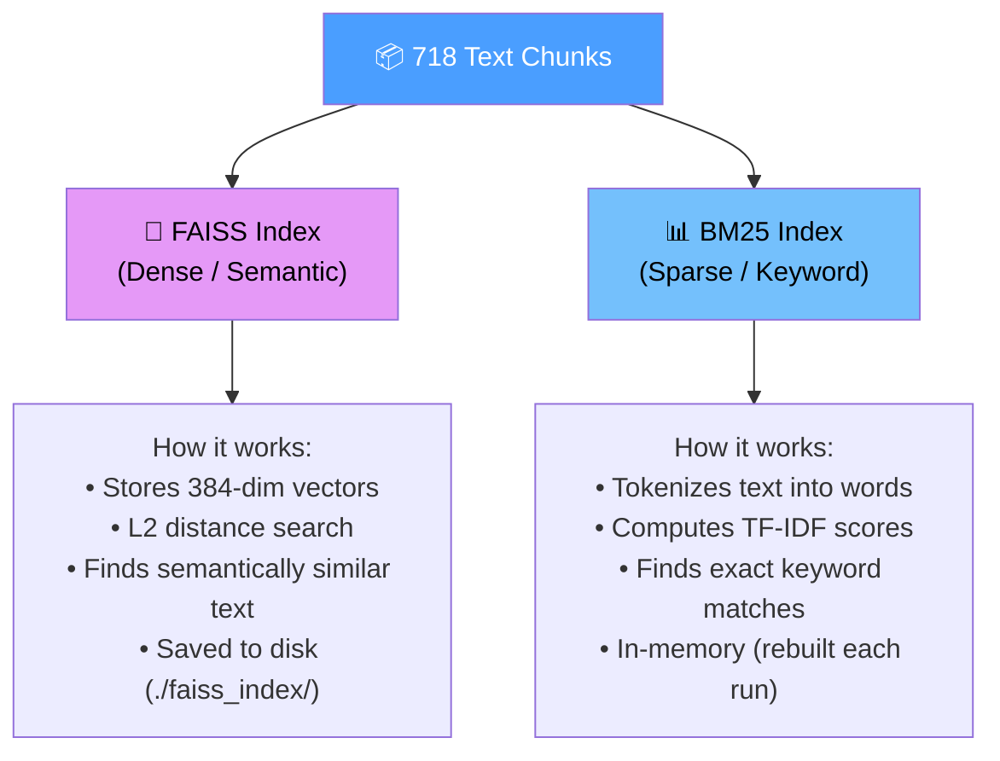

**FAISS (vectorstore.py)**:
- Embeds all 718 chunks into vectors
- Builds an `IndexFlatL2` (exact nearest-neighbor search)
- Saves to `./faiss_index/` on disk — loads from cache on subsequent runs
- Query: embed the question → find top-K nearest chunk vectors

**BM25 (search.py)**:
- Tokenizes every chunk into words
- Computes term frequency (TF) and inverse document frequency (IDF)
- Query: tokenize the question → score each chunk by keyword overlap
- Rebuilt in-memory every run (fast — takes <1 second)

---

### Step 5: Hybrid Retrieval (`search.py`)

When a question arrives, **both** retrievers search independently, and their results are fused.

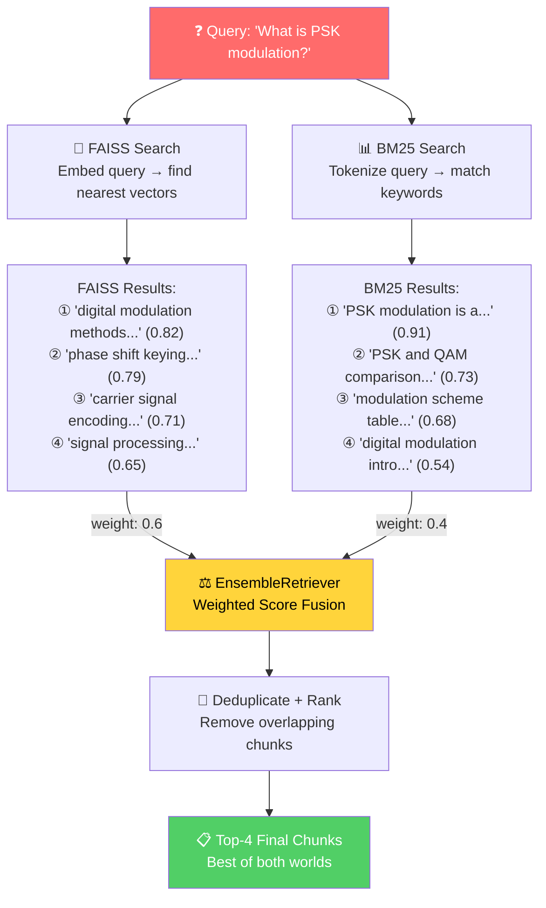

**Why this works better than either alone**:
- FAISS found "phase shift keying" (synonym of PSK) — BM25 would miss this
- BM25 found the exact phrase "PSK modulation" — FAISS might rank it lower
- Together, the chunk containing both the exact term AND semantic relevance scores highest

---

### Step 6: Self-Correcting LangGraph Flow (`graph.py`)

This is the most advanced part of the pipeline. Instead of blindly generating an answer from retrieved chunks, the system **checks if the chunks are actually relevant** and retries with a rewritten query if they're not.

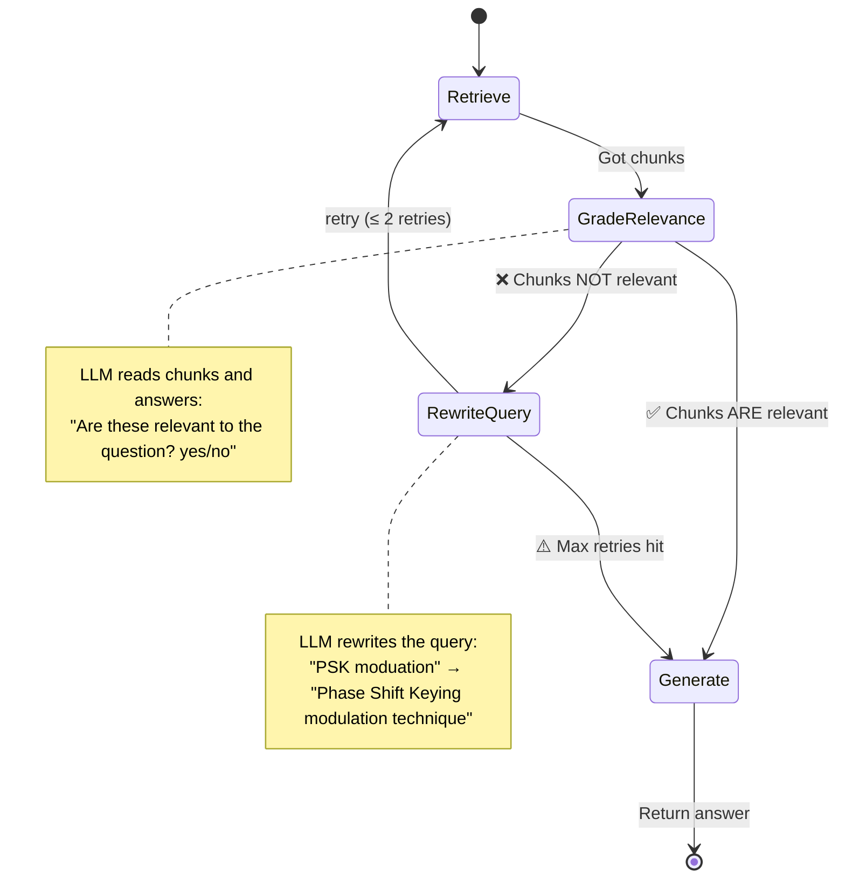

**Example of self-correction in action**:

```
Round 1:
  Query: "whats the PSK moduation methodlogy"  (typo!)
  Retrieved chunks: mostly about "methodology" in general (not PSK)
  Grade: ❌ NOT relevant
  → Rewrite: "Phase Shift Keying PSK modulation technique"

Round 2:
  Query: "Phase Shift Keying PSK modulation technique"  (cleaner!)
  Retrieved chunks: actual PSK content from BlackBook.pdf
  Grade: ✅ RELEVANT
  → Generate answer from these chunks
```

**The flow handles 4 scenarios**:

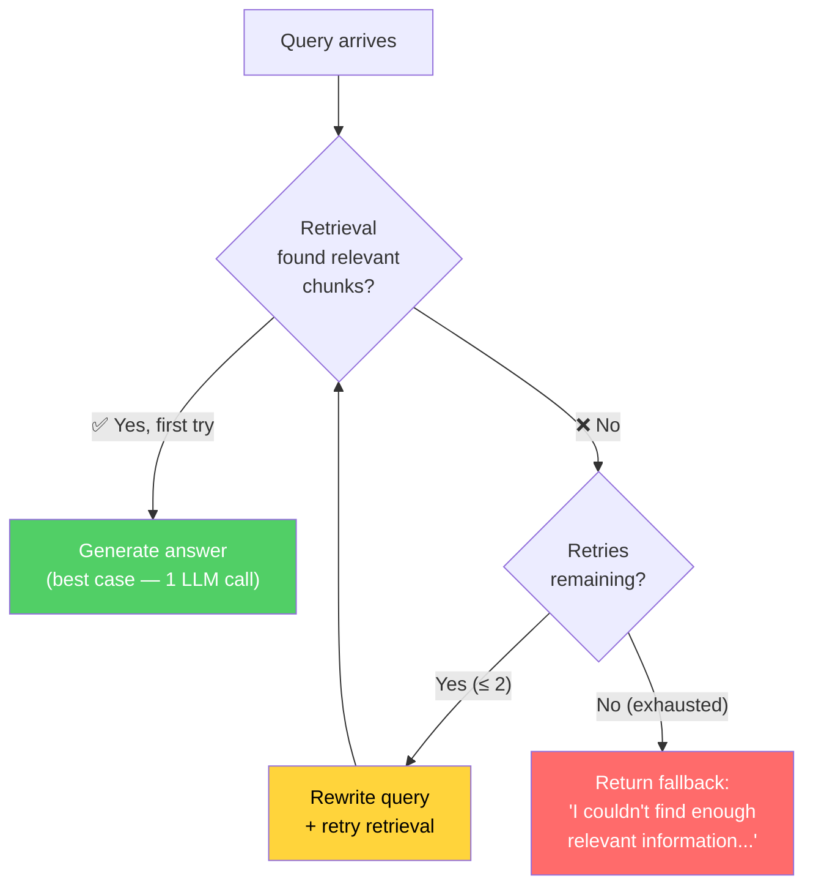

---

### Step 7: Answer Generation (`llm.py`)

Once relevant chunks are confirmed, the LLM generates a **grounded** answer.

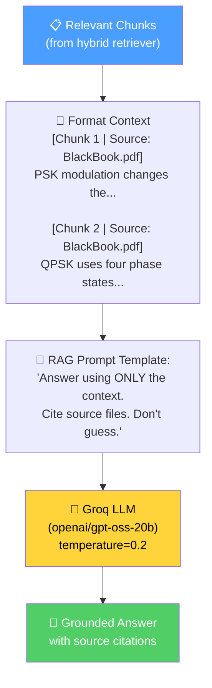

**The RAG prompt enforces grounding**:
```
Rules:
- Answer using only the information in the context. Do not use outside knowledge.
- If the context doesn't contain enough information to answer, say so clearly — don't guess.
- Cite the source file name(s) you used when possible.
- Be concise and direct.
```

**Context is formatted with source attribution**:
```
[Chunk 1 | Source: data\BlackBook.pdf]
PSK (Phase Shift Keying) is a digital modulation technique where the phase
of the carrier signal is varied to represent data...

[Chunk 2 | Source: data\BlackBook.pdf]
In QPSK, four phase states (0°, 90°, 180°, 270°) are used, allowing
2 bits per symbol...
```

This labeling enables the LLM to cite specific source files in its answer.

---

##  Complete End-to-End Example

Let's trace a real query through every step of the pipeline:

### Query
```
Question: What modulation techniques are discussed in the documents?
```

### Step-by-Step Trace

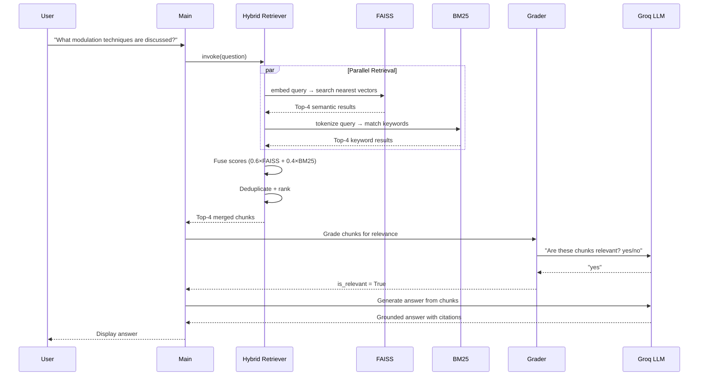

### What Each Retriever Finds

| # | Retriever | Chunk Preview | Why Found |
|---|---|---|---|
| 1 | FAISS | "PSK (Phase Shift Keying) is a digital modulation technique where the phase of the carrier signal is varied..." | Semantic match: "modulation techniques" ≈ "digital modulation technique" |
| 2 | BM25 | "Table 3.2: Comparison of modulation techniques — BPSK, QPSK, 16-QAM..." | Exact keyword match: "modulation techniques" |
| 3 | FAISS | "OFDM divides the available spectrum into multiple orthogonal subcarriers for parallel data transmission..." | Semantic match: OFDM is a modulation-related concept |
| 4 | BM25 | "The modulation scheme determines the number of bits per symbol and affects the BER performance..." | Keyword match: "modulation" |

### Final Generated Answer

```
Answer:
The documents discuss several modulation techniques:

1. **PSK (Phase Shift Keying)** — a digital modulation technique where the phase of the
   carrier signal is varied to represent data bits. BPSK uses two phase states (0° and 180°),
   while QPSK uses four phase states allowing 2 bits per symbol.
   (Source: data\BlackBook.pdf)

2. **OFDM (Orthogonal Frequency Division Multiplexing)** — divides the spectrum into
   multiple orthogonal subcarriers for parallel data transmission, improving spectral
   efficiency in multipath channels.
   (Source: data\BlackBook.pdf)

3. **16-QAM** — mentioned in a comparison table alongside BPSK and QPSK, offering higher
   data rates but requiring better SNR.
   (Source: data\BlackBook.pdf)

These techniques are discussed in the context of digital communication systems and
wireless channel performance analysis.
```

---

## 🚀 Installation

### Prerequisites

- **Python 3.11+**
- **Groq API Key** (free): [https://console.groq.com/keys](https://console.groq.com/keys)
- (Optional) **Tesseract OCR** for image text extraction: [Install Guide](https://github.com/tesseract-ocr/tesseract)
- (Optional) **NVIDIA GPU** with CUDA for faster embedding generation

### Setup

```bash
# 1. Clone the repository
git clone https://github.com/your-username/hybrid-rag.git
cd hybrid-rag

# 2. Create and activate virtual environment
python -m venv .venv

# Windows
.venv\Scripts\activate

# macOS/Linux
source .venv/bin/activate

# 3. Install dependencies
pip install -r requirements.txt

# 4. (Optional) Install CUDA-enabled PyTorch for GPU acceleration
pip install --force-reinstall torch torchvision torchaudio --index-url https://download.pytorch.org/whl/cu121

# 5. Configure environment
cp .env.example .env
# Edit .env and add your GROQ_API_KEY
```

### Configuration (`.env`)

```ini
# Required
GROQ_API_KEY=your_groq_api_key_here

# Document source folder
DATA_DIR=./data

# FAISS index persistence
FAISS_INDEX_DIR=./faiss_index

# Hybrid retrieval weights (must sum to 1.0)
SEMANTIC_WEIGHT=0.6
KEYWORD_WEIGHT=0.4
RETRIEVER_TOP_K=4

# Self-correction retry limit
MAX_RETRIEVAL_RETRIES=2

# LLM settings
GROQ_MODEL=openai/gpt-oss-20b
GROQ_TEMPERATURE=0.2

# GPU: uncomment to force device ("cpu" or "cuda")
# EMBEDDING_DEVICE=cuda
```

---

## ▶ Running the Project

```bash
# 1. Add your documents to the data/ folder
#    Supported: PDF, DOCX, CSV, Excel, TXT, PNG/JPG (OCR)

# 2. Run the pipeline
python main.py
```

### What Happens on First Run

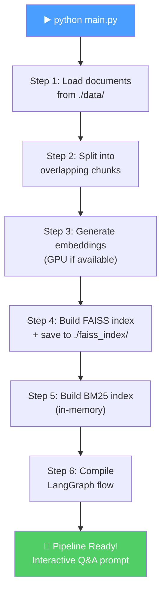

### What Happens on Subsequent Runs

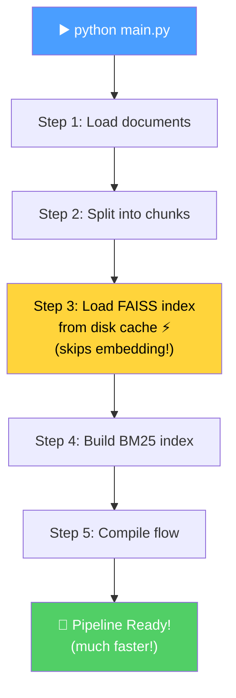

```
Pipeline ready.

Ask a question about your documents (or type 'exit' to quit).

Question: What is this document about?

Answer:
This document covers digital communication systems, focusing on...

------------------------------------------------------------
```

---

## Technical Decisions

### Why Hybrid RAG over Pure Vector Search?

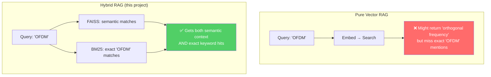

### Why `all-MiniLM-L6-v2`?

- **384 dimensions** — compact, fast to index and search
- **22M parameters** — lightweight enough to run on CPU, fast on GPU
- **Strong general-purpose performance** on sentence similarity benchmarks
- Free, no API key needed — runs entirely locally

### Why Recursive Character Splitting?

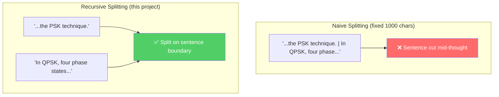

The splitter tries `\n\n` → `\n` → `. ` → ` ` → hard cut. The 150-char overlap prevents information loss at boundaries.

### Why LangGraph Self-Correction?

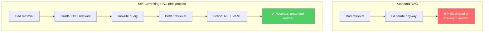

---

## Current Limitations

- **No reranking stage** — retrieved chunks go directly to the LLM without cross-encoder reranking
- **No Reciprocal Rank Fusion (RRF)** — uses simple weighted fusion instead of the more robust RRF algorithm
- **BM25 not persisted** — rebuilt in-memory every run (fast, but redundant work)
- **No metadata filtering** — cannot filter by file type, date, or custom tags
- **No streaming** — answers appear all at once after full generation
- **Single embedding model** — no query-document asymmetric embedding support

---

## Future Roadmap

- [ ] Cross-encoder reranking (`cross-encoder/ms-marco-MiniLM-L-6-v2`)
- [ ] Reciprocal Rank Fusion (RRF) for score combination
- [ ] Context compression before LLM call
- [ ] Metadata filtering (by file type, source, date)
- [ ] Streaming LLM responses
- [ ] Web UI (Streamlit or Gradio)
- [ ] Multi-hop reasoning for complex queries
- [ ] Evaluation framework (RAGAS metrics)

---

## Tech Stack

| Component | Technology |
|---|---|
| Orchestration | LangChain, LangGraph |
| LLM | Groq (`openai/gpt-oss-20b`) |
| Embeddings | HuggingFace `all-MiniLM-L6-v2` |
| Vector DB | FAISS (CPU/GPU) |
| Keyword Search | BM25 (`rank-bm25`) |
| Document Parsing | PyPDF, python-docx, Tesseract OCR |
| Language | Python 3.11+ |

---

## License

This project is for educational and personal use only. 
